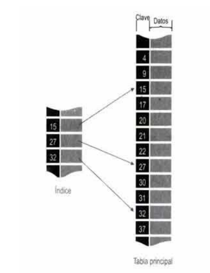

# Que son los archivos indexados 
- Los archivos indexados, son aquellos que incluyen indices en el almacenamiento de los registros; de esta forma nos sera mas facil buscar un registro determinado sin necesidad de recorrer todo el archivo.

- Un campo (o un grupo de campos) del registro denominado CLAVE es utilizado como campo de indice. Por ejemplo, en una aplicacion bancaria, podria existir un archivo de registros que describen a las socursales.

# Como esta constituido fisicamente un archivo
En la **vista fisica** de un archivo indexado, observaremos dos areas: el area de indices y el area de datos.

- El **area de indices** consiste en un listado de todos los valores del campo clave de los registros en el archivo, junto con la posicion del registro correspondiente en el almacenamiento masivo (**area de datos**).

- El area de indices esta SIEMPRE ORDENADA de menor valor de clave a mayor valor. Mientras que en el area de Datos los registros de informacion no necesariamente guardan algun tipo de orden, **los registros se almacenan de acuerdo a las disponibilidades libres que tenia la memoria en el momento que se genero la oreden de grabacion**.

<h1>Imagen de Archivos Indexados</h1>

<button>



<p>Los indices apoyan las aplicaciones que acceden <strong><u>selectivamente registros individuales, en lugar de buscar a traves de toda la coleccion de registros en secuencia</strong></u>.</p>

</button>

---

# Vervos para archivos indexados

```bash
    #SECUENCIA DE DATOS ELEMENTALES:
    ARRANCAR(Secuencia);
    ---------------------------
    AVANZAR(Secuencia, ventana);
    ---------------------------
    CREAR(Secuencia);
    ---------------------------
    ESCRIBIR(Secuencia, Ventana);
    ---------------------------

    #ARCHIVO SECUENCIAL:
    ABRIR E/(Arch);
    ---------------------------
    LEER(Arch, Reg);
    ---------------------------
    ABRIR S/(Arch);
    ---------------------------
    ESCRIBIR(Arch, Reg);
    GRABAR(Arch, Reg);
    ---------------------------
    
    #ARCHIVO INDEXADO:
    ABRIR E/(Arch);
    ABRIR E/S(Arch);
    ---------------------------
    CLAVE:=Informacion;
    LEER(Arch, Reg);
    ---------------------------
    ABRIR S(Arch);
    ---------------------------
    ARCHIVO EXISTENTE
    RE-ESCRIBIR(Arch, Reg);
    REGRABAR(Arch, Reg);
    ---------------------------

```
---

# Grabar versus regrabar

- Cuando un archivo, sin importar a que organizacion se refiera, es abierto como **archivo de salida**, es seguro que durante el proceso existira la orden de grabar en el mismo. Para proceder a grabar, previamente se deben asignar a cada uno de los campos del registro de salida, los contenidos correspondientes. Estos contenidos se pueden obtener de distintos lugares dentro del proceso (archivo de entrada, calculos, etc) y generalmente no se asignan todos juntos a ultimo momento sino, que se van trasladando a medida que se van obteniendo.

- La orden grabar el registro se debe efectuar cuando la logica del procedimiento de obtencion de los datos ya haya finalizado, **el registro ya contiene todos los datos necesarios**.

- El proceso de grabacion, implica que se buscara generar un NUEVO registro en el archivo correspondiente. 

<h3 style="color: rgb(255, 0, 13);">
    Si el archivo de salida es de organizacion secuencial, esto sifnificara agregar a continuacion del ultimo registro emitido, dado que este tipo de organizacion oblica a la continuidad fisica.
</h3>
<b>Que puede ocurrir?<p style="color: rgb(76, 102, 187);">De no existir espacio fisico continuo disponible, se producira un error, y se emitira un aviso de ello(error de sintaxis), y en muchos casos una interrupcion definitiva del programa.</p> De no haber inconvenientes, se procede a grabar el registro y continua con la logica del programa. Solo para los archivos con Organizacion Directa, es posible utilizar ademas del verbo grabar el verbo Regrabar.

Para poder hacer uso del mismo, se debe haber abierto el archivo como de entrada/salida. En este ultimo caso, la apertura del archivo E/S, hace que tanto se puedan crear registros nuevos mediante el verbo grabar, como, habiendo previamente leido un registro, producir modificaciones sobre algunos de los contenidos en los campos del mismo y entonces la orden de salida sera Regrabar.
Como el registro ya está leído, el espacio de memoria está asignado, por lo que esta orden
no genera error por falta de espacio, dado que se reescribe sobre el mismo.

Entonces ¿Que puede ocurrir?, el error de producirse se deberá a un
problema de lógica (error nuestro), estamos intentando regrabar sin
haber previamente leído, o (muy raro) que se haya perdido el enlace
con el área de lectura.

</b> 

# Conclusion

**Grabar** -> Crear un nuevo registro  en un archivo.
- Significa agregar datos nuevos al archivo.
- Imagina que estas escribiendo una nueva linea al final de un cuaderno.
- Esto necesita espacio fisico disponible para que los nuevos datos puedan guardarse. 

**Regrabar** -> Modificar un registro existente en el archivo.
- Solo lo podes usar si el archivo tiene organizacion directa (acceso aleatorio).

