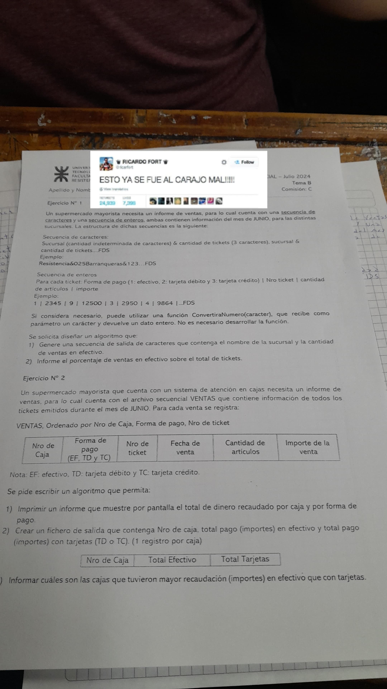

Algoritmos: 
    Un **algoritmo** es una secuencia finita de instrucciones, reglas o pasos que describen de modo preciso las operaciones que una computadora debe realizar para ejecutar una tarea determinada en un tiempo finito.

- ENTENDER EL PROBLEMA Y LA NECESIDAD: 
- INDIVIDUALIZAR LOS DATOS: **DEFINIR DATOS DE ENTRADA**.
- PLANTEAR LOS PROCESOS PARA LA ENTRADA A LOS DATOS DE SALIDA.

Secuencias: Es un conjunto de datos relacionados entre si:
| A | L | G | O | R | I | T | M | O | ... | FDS |
  1   2   3   4   5   6   7   8   9   ...    n

- **Existencia del primer elemento de la secuencia**: Acceso posterior a los demas elementos

Ejercicios Nro 1: Del Primer parcial: **PRACTICA**:
Una cadena de restaurantes de la ciudad de resistencia necesita realizar un informe con todos los comentarios que realizaron los clientes, para ello cuenta con dos secuencias de caracteres con el siguiente formato:
- Secuencia de caracteres:
Sucursal (cantidad indeterminada de caracteres) & cantidad de tickets (3 caracteres). Sucursal & cantidad de tickets....FDS
Ejemplo:
Resistencia&025Barranqueras&123...FDS
- Secuencia de enteros:
Para cada ticket: Forma de pago(1: efectivo, 2: tarjeta debito y 3: tarjeta credito)

**TEORIA**: Del Primer parcial: 

