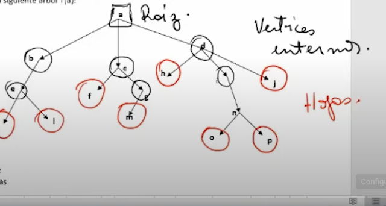

# Arbol: arbitrario, sin ciclos, conexo
si posee ciclos no es un arbol

Raiz, Vertices internos y Hojas

Antecesores de los vertices, son los que estan mas arriba de cada vertice. Obviamente que de la **Raiz** no hay antecesor!.

