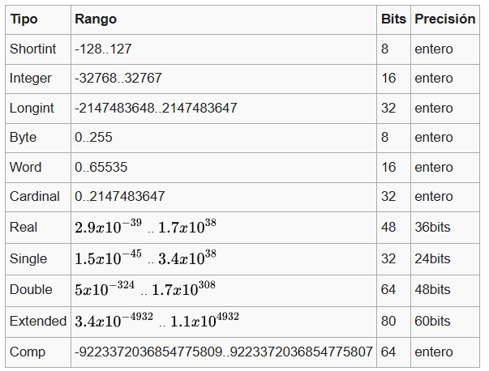

# OSoil
# 🚀 ¿Cómo arrancar?
# Guia:

``` 
    https://github.com/Fr0sT-Brutal/awesome-pascal#multimedia

    https://wiki.osdev.org/Expanded_Main_Page
    Writing a Simple Operating System — from Scratch (James Molloy)
```

## 🧩 Paso 1: Crea un bootloader
**Un programa que corre en los primeros 512 bytes del disco.**

**Escrito en ASM (assembly).**

**Lo cargas usando BIOS.**

**Tu objetivo es simplemente mostrar un "Hola Mundo" en pantalla desde el bootloader.**

**Herramientas:**

**Ensamblador: NASM**

**Emulador: QEMU (o Bochs)**

**Para generar la ISO: dd, mkisofs, etc.**

# 🔧 Paso 2: Cargar un kernel en C
## Modificás tu bootloader para que cargue tu kernel (escrito en C).

**Usás un archivo .bin y le indicás al bootloader que lo cargue en memoria.**

## Ya podrías hacer cosas como imprimir texto, leer del teclado, y eventualmente manejar interrupciones.

# 🧰 Herramientas importantes:
## NASM (ensamblador)

## GCC (cross-compilation, ej. i686-elf-gcc)

## QEMU (para probar tu OS sin dañar tu PC)

## GRUB (como bootloader real una vez que superás el básico)

## Makefiles (para compilar más fácilmente)

# Comenzar a practicar assembly es importante para el desarrollo de la consola de mi Sistema Operativo
**Crea un gestionador de procesos para que tengan prioridades las tareas del sistema operativo y gestionarlas con las que se ejecutan.**


# Configurar el Bootloader y aprender C 
## - que es un Bootloader 


# Pascal Proyectos : Archivos txt y  con binarios
🔢 1. Calculadora Básica
Suma, resta, multiplicación y división entre dos números.

Puedes usar case para elegir la operación.

Ideal para practicar entradas (readln) y salidas (writeln), además de operadores.

📅 2. Calculadora de Edad
Pide el año de nacimiento y el año actual, y calcula la edad.

Puedes mejorarlo con condicionales: si aún no cumplió años este año, restar uno.

📈 3. Conversor de Unidades
Conversor de kilómetros a millas, Celsius a Fahrenheit, etc.

Puedes usar funciones para cada conversión.

🔁 4. Tabla de Multiplicar
Pide un número y muestra su tabla de multiplicar del 1 al 10 usando un for.

💻 5. Mini Menú con Opciones
Crea un programa con un pequeño menú (por ejemplo: opción 1 = mostrar mensaje, 2 = salir).

Ideal para aprender a usar repeat...until o while.


---


# Tarea
## Dia π
Desafío 1: Fibonacci Básico
Implementa una función que devuelva el n-ésimo término de la secuencia de Fibonacci
Entrada: Un número entero n (0 <= n <= 40)
Salida: El n-ésimo término de la secuencia.
Ejemplo:
Entrada: 10
Salida: 55
Restricciones: Solución iterativa o recursiva SIN optimización.
Recuerden envíar su código usando las triples comillas invertidas

## Desafío 2: Fibonacci Optimizado
Optimiza el cálculo del n-ésimo término de Fibonacci utilizando memoización o programación dinámica.
Entrada: Un número entero n (0 <= n <= 10^6)
Salida: El n-ésimo término de Fibonacci módulo 10^9+7
Ejemplo:
**Entrada** 1000000
**Salida**: ??? (gran número)

Restricciones: La solución debe ejecutrase en O(log n) o mejor

# RESPUESTA:


## Desafío 3: Suma de Dígitos en la Expansión de π
Calcula la suma de los primeros n dígitos de la expansión edcimal de π  (sin incluir el "3.").
Entrada: Un número entero n (1 <= n <= 10^4)
Salida: La suma de los primeros n dígitos después del punto decimal.
Ejemplo:
**Entrada**: 5
**Salida**: 23 (porque 14159 -> 1+4+1+5+9 = 23)

Restricciones: NO PUEDES usar librerías que directamente devuelvan los dígitos de π, debes calcularlos.

## Desafío 4: Aprox. de π con Monte Carlo
Estima el valor de π usando el método de Monte Carlo con n puntos aleatorios.
Entrada: Un número entero n (10^4 <= n <= 10^8)
Salida: Una estimación de π con al menos 5 decimales correctos.
Ejemplo:
**Entrada**: 1000000  
**Salida**: 3.14159

Restricciones: La solución debe ejecutarse en tiempo razonable para n = 10^8

## Desafío 5: π en la Transformada de Fourier
Se te da una señal de audio discretizada en N puntos. Usa la Transformada Rápida de Fourier (FFT) para encontrar la frecuencia dominante y verificar si está relacionada con π.
Entrada: Un número entero N (1024 <= N <= 2^16), seguido de N valores que representan una señal.
Salida: La frecuencia dominante y un mensaje indicando si está relacionada con π.
Ejmeplo:
**Entrada**:
1024
0.0 1.0 0.0 -1.0 0.0 1.0 ... (senoidal)
Salida: 
Frecuencia dominante 314.159 Hz
Está relacionada con π

Restricciones Debes implementar FFT en O(N log N)

